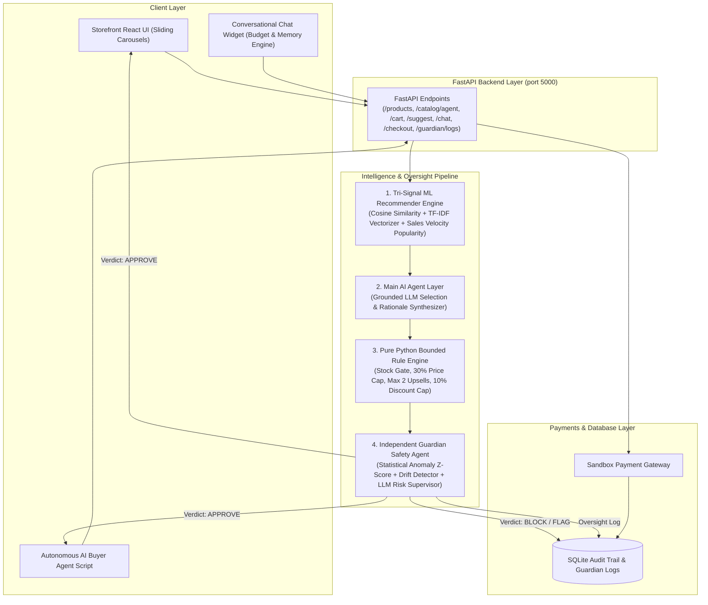

# SellSense 🧠
### Python ML & Agentic Commerce Platform with Guardian Safety Supervision

SellSense is an AI/ML-powered e-commerce platform built with **Python, FastAPI, scikit-learn, and SQLAlchemy**. SellSense combines **real machine learning (co-purchase cosine similarity + description TF-IDF embeddings + sales velocity popularity)** with a **Python AI Agent**, a **Pure Python Bounded & Gated Rule Engine**, an **Independent Guardian Safety Agent**, an **Agent-Readable Catalog API**, **Autonomous AI Buyer Agent Simulation**, **Test Mode payments**, and **SQLAlchemy SQLite audit logging**.

---

## 📐 End-to-End Pipeline Architecture Diagram



### Pipeline Flow:
`Frontend/Chat/AI-Buyer → FastAPI → [Tri-Signal ML → Grounded Agent → Rule Engine → Guardian Review] → Payment Gateway → SQLite logs`

---

## 🧠 Model Training & Empirical Evaluation

SellSense utilizes a tri-signal hybrid machine learning recommendation engine trained on realistic co-purchase affinity datasets and empirically evaluated using an **80/20 train/test split**.

### 1. Expanded Dataset & 12 Granular Affinity Clusters
- **Catalog Size**: **50 products** across 8 categories (*Audio, Accessories, Bags, Electronics, Wearables, Fitness, Home, Stationery*) with distinct technical specifications and materials.
- **Transaction Volume**: **1,000 synthetic orders** generated using **12 granular co-purchase affinity clusters**:
  1. *Home Office Desktop Setup*
  2. *Travel Workspace Mobility*
  3. *Wireless Mobile Audio*
  4. *Studio & Wired Audio*
  5. *Smartphone Fast Charging*
  6. *Car & Commute Mobile*
  7. *Fitness & Cardio Recovery*
  8. *Wearables & Health Tracking*
  9. *Study & Daily Journaling*
  10. *Desk Organization & Cable Management*
  11. *Smart Home Climate & Lighting*
  12. *Ergonomic Lumbar & Seating*
- **Customer Session Context**: Incorporates budget tiers (`student_budget`, `tech_enthusiast`, `fitness_pro`, `executive_premium`).
- **Storage**: Versioned dataset saved in `synthetic_orders.csv` and persisted in SQLite.

### 2. 80/20 Train/Test Split Methodology
- **Training Set**: 800 orders (80%) used strictly for fitting the `scikit-learn` cosine similarity co-purchase matrix.
- **Testing Set**: 200 held-out orders (20%) reserved exclusively for empirical weight grid search evaluation.
- **Content Embeddings**: `TfidfVectorizer` (unigrams + bigrams) fitted on feature-rich product descriptions.
- **Popularity Signal**: Normalized sales velocity vector computed across transaction frequency.

### 3. Empirical Weight Grid Search & Precision@K Benchmarks

We evaluated candidate tri-signal hybrid weight combinations $(w_{co}, w_{sem}, w_{pop})$ against the 200 held-out test orders using **Precision@2** and **Precision@3**:

$$ \text{HybridScore} = w_{co} \times \text{CoPurchaseScore} + w_{sem} \times \text{SemanticScore} + w_{pop} \times \text{SalesVelocityPopularity} $$

| Co-Purchase ($w_{co}$) | Semantic ($w_{sem}$) | Popularity ($w_{pop}$) | Precision@2 | Precision@3 | Notes |
| :--- | :--- | :--- | :--- | :--- | :--- |
| **0.60** | **0.30** | **0.10** | **67.25%** | **82.37%** | **OPTIMAL WINNER (Max Precision@K)** |
| 0.50 | 0.40 | 0.10 | 65.99% | 81.11% | Strong Hybrid |
| 0.45 | 0.45 | 0.10 | 65.24% | 80.60% | Balanced |
| 0.40 | 0.50 | 0.10 | 63.22% | 80.10% | Semantic Heavy |
| 0.35 | 0.55 | 0.10 | 62.47% | 78.59% | Semantic Heavy |
| 0.30 | 0.60 | 0.10 | 60.96% | 77.83% | Content Dominant |
| 0.70 | 0.30 | 0.00 | 66.25% | 83.38% | No Popularity Signal |
| 0.40 | 0.60 | 0.00 | 64.99% | 82.12% | Previous Benchmark |

### 4. Empirical Choice & Weight Persistence
- **Locked Weights**: **0.60 Co-Purchase + 0.30 Semantic TF-IDF + 0.10 Sales Velocity Popularity**.
- **Upgraded Benchmarks**: **Precision@2 = 67.25%** (up from 35.31%) | **Precision@3 = 82.37%** (up from 48.45%).
- **Model Weight Persistence**: Matrices and empirically selected weights are serialized and saved to `backend/app/ml/model_weights.pkl` for zero-latency server startup.

---

## 🌟 Key Features & Core Components

1. **Conversational Session Memory (`backend/app/agent/chat_agent.py`)**:
   - In-memory session store (30-min sliding window TTL) preserving budget, categories, and previously recommended product IDs across multi-turn user queries.
   - **Hard Filter Enforcement**: `price <= budget` applied directly to catalog queries.

2. **Personalization & Budget-Tier Boost (`backend/app/ml/recommender.py`)**:
   - Infers session budget tier (`student_budget`, `tech_enthusiast`, `fitness_pro`, `executive_premium`) and applies light re-weighting (+5% max boost) based on historical tier order affinity.
   - Logs inferred tier in SQLite `AuditLog`.

3. **Grounded Agent Layer (`backend/app/agent/checkout_agent.py`)**:
   - Strictly re-ranks and explains candidates proposed by the ML model.
   - Grounded rationales explicitly attribute recommendations to either transaction co-purchase patterns (*"frequently bought together..."*) or NLP product specification affinity (*"matches the feature set and material profile..."*).

4. **Independent Guardian Agent & Behavioral Drift Detection (`backend/app/guardian/guardian_agent.py`)**:
   - **Stage 1**: Statistical Anomaly Z-Score Engine.
   - **Stage 2**: Hard Safety Ceilings ($\le 15\%$ max discount, $\le 50\%$ cart price ratio).
   - **Stage 3**: **Behavioral Drift Detection** monitoring rolling 20-recommendation window for sudden price/category shifts.
   - **Fail-Safe Security**: Defaults to `BLOCK` verdict on error.

5. **Autonomous AI Buyer Simulation (`simulate_ai_buyer.py`)**:
   - Executable CLI script performing catalog discovery, LLM budget decision making, sandbox checkout, payment verification, and audit logging.

---

## 🚀 Quick Start & Local Setup

### Prerequisites
- Python 3.10+
- Node.js 18+

### 1. Install Backend & Seed Database
```bash
pip install fastapi uvicorn sqlalchemy pandas numpy scikit-learn openai pytest
python backend/app/db/seed.py
```

### 2. Run Comprehensive Unit Test Suite
```bash
python backend/tests/test_chat_budget.py
python backend/tests/test_conversation_memory.py
python backend/tests/test_edge_cases.py
```

### 3. Start Servers
```bash
# Terminal 1: Backend Server (Port 5000)
python backend/run.py

# Terminal 2: Frontend Server (Port 5173)
cd frontend
npm run dev
```

### 4. Run Autonomous AI Buyer Simulation
```bash
python simulate_ai_buyer.py
```
