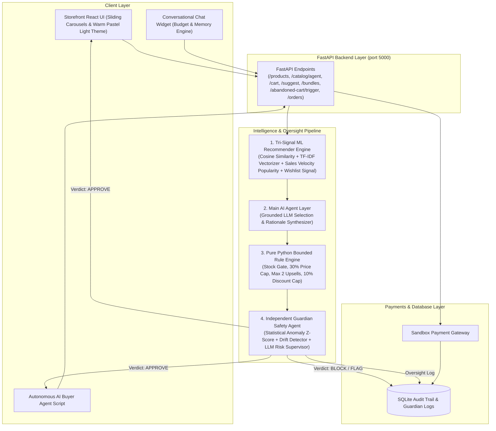

# SellSense 🧠
### Python ML & Agentic Commerce Platform with Guardian Safety Supervision

SellSense is an AI/ML-powered e-commerce platform built with **Python, FastAPI, scikit-learn, and SQLAlchemy**. SellSense combines **real machine learning (co-purchase cosine similarity + description TF-IDF embeddings + sales velocity popularity)** with a **Python AI Agent**, a **Pure Python Bounded & Gated Rule Engine**, an **Independent Guardian Safety Agent**, an **Agent-Readable Catalog API**, **Autonomous AI Buyer Agent Simulation**, **Test Mode payments**, and **SQLAlchemy SQLite audit logging**.

---

## 📐 End-to-End Pipeline Architecture Diagram



### Pipeline Flow:
`Frontend/Chat/AI-Buyer → FastAPI → [Tri-Signal ML → Grounded Agent → Rule Engine → Guardian Review] → Payment Gateway → SQLite logs`

---

## 🧠 Model Training & Empirical Evaluation

SellSense utilizes a tri-signal hybrid machine learning recommendation engine trained on realistic co-purchase affinity datasets and empirically evaluated using an **80/20 train/test split**.

### 1. Expanded Catalog (80 Products • 10 Categories • 1,500 Orders)
- **Catalog Size**: **80 products** across 10 categories (*Audio, Accessories, Bags, Electronics, Wearables, Fitness, Home, Stationery, Gifting, Travel*) with multi-tier price depth (budget, mid-range, premium).
- **Transaction Volume**: **1,500 synthetic orders** generated using **15 granular co-purchase affinity clusters**:
  1. *Home Office Desktop Setup*
  2. *Travel Workspace Mobility*
  3. *Wireless Mobile Audio*
  4. *Studio & Wired Audio*
  5. *Smartphone Fast Charging*
  6. *Car & Commute Mobile*
  7. *Fitness & Cardio Recovery*
  8. *Wearables & Health Tracking*
  9. *Study & Daily Journaling*
  10. *Desk Organization & Cable Management*
  11. *Smart Home Climate & Lighting*
  12. *Ergonomic Lumbar & Seating*
  13. *Gifting & Executive Desk Sets* (NEW)
  14. *International Travel Essentials* (NEW)
  15. *Premium Executive Tech Workstation* (NEW)
- **Customer Session Context**: Incorporates budget tiers (`student_budget`, `tech_enthusiast`, `fitness_pro`, `executive_premium`, `frequent_traveler`, `gift_shopper`).
- **Storage**: Versioned dataset saved in `synthetic_orders.csv` and persisted in SQLite.

### 2. 80/20 Train/Test Split Methodology
- **Training Set**: 1,200 orders (80%) used strictly for fitting the `scikit-learn` cosine similarity co-purchase matrix.
- **Testing Set**: 300 held-out orders (20%) reserved exclusively for empirical weight grid search evaluation.
- **Content Embeddings**: `TfidfVectorizer` (unigrams + bigrams) fitted on feature-rich product descriptions.
- **Popularity Signal**: Normalized sales velocity vector computed across transaction frequency.

### 3. Empirical Weight Grid Search & Precision@K Benchmarks

Candidate tri-signal hybrid weight combinations $(w_{co}, w_{sem}, w_{pop})$ evaluated against the 300 held-out test orders using **Precision@2** and **Precision@3**:

$$ \text{HybridScore} = w_{co} \times \text{CoPurchaseScore} + w_{sem} \times \text{SemanticScore} + w_{pop} \times \text{SalesVelocityPopularity} $$

| Co-Purchase ($w_{co}$) | Semantic ($w_{sem}$) | Popularity ($w_{pop}$) | Precision@2 | Precision@3 | Notes |
| :--- | :--- | :--- | :--- | :--- | :--- |
| **0.60** | **0.30** | **0.10** | **48.41%** | **63.60%** | **OPTIMAL WINNER (80 Products Catalog)** |
| 0.50 | 0.50 | 0.00 | 48.41% | 63.04% | Equal Weight Hybrid |
| 0.50 | 0.40 | 0.10 | 48.22% | 62.10% | Strong Hybrid |
| 0.70 | 0.30 | 0.00 | 47.28% | 64.35% | Co-Purchase Heavy |
| 0.45 | 0.45 | 0.10 | 46.15% | 61.35% | Balanced |
| 0.40 | 0.60 | 0.00 | 45.97% | 62.10% | Semantic Heavy |
| 0.35 | 0.55 | 0.10 | 43.34% | 58.91% | Semantic Dominant |
| 0.25 | 0.65 | 0.10 | 37.15% | 46.34% | Content Dominant |

---

## 🌟 Expanded Agentic Commerce Capabilities

1. **Wishlist / Save for Later & Soft Personalization Signal**:
   - Heart toggle on product cards & dedicated Wishlist drawer in Navbar.
   - Factors saved items into the ML recommender matrix as a soft **0.3x weighted personalization signal** alongside cart items.

2. **AI-Generated Bundle Builder (`/api/bundles`)**:
   - Proactively constructs 2-3 item co-purchase product bundles ("Complete Workspace", "Travel Essentials", "Executive Gifting") with 10% bounded discount.
   - Evaluated through Rule Engine and Guardian Agent checkpoints.

3. **Abandoned Cart Recovery Agent (`/api/abandoned-cart/trigger`)**:
   - Re-engagement flow generating personalized cart messages with a 5% bounded bonus incentive.
   - Logged under `Abandoned Cart Recovery Agent` in the SQLite Audit Trail to showcase unified safety oversight across multiple agent types.

4. **Order History & Post-Purchase Agent (`/api/orders` & `/api/orders/post-purchase-chat`)**:
   - Displays past completed SQLite orders with tracking information.
   - Interactive Post-Purchase Agent answering delivery queries ("when will this arrive?") and cross-sell pairing questions using the ML recommender engine on past purchases.

5. **Independent Guardian Agent & Behavioral Drift Detection (`backend/app/guardian/guardian_agent.py`)**:
   - Statistical Anomaly Z-Score Engine & Rolling 20-recommendation Behavioral Drift Detector.
   - Fail-Safe Security: Defaults to `BLOCK` verdict on error.

---

## 🚀 Quick Start & Local Setup

### Prerequisites
- Python 3.10+
- Node.js 18+

### 1. Install Backend & Seed Database
```bash
pip install fastapi uvicorn sqlalchemy pandas numpy scikit-learn openai pytest
python backend/app/db/seed.py
```

### 2. Run Comprehensive Unit Test Suite
```bash
python backend/tests/test_chat_budget.py
python backend/tests/test_conversation_memory.py
python backend/tests/test_edge_cases.py
python backend/tests/test_suggest_carts.py
```

### 3. Start Servers
```bash
# Terminal 1: Backend Server (Port 5000)
python backend/run.py

# Terminal 2: Frontend Server (Port 5173)
cd frontend
npm run dev
```

### 4. Run Autonomous AI Buyer Simulation
```bash
python simulate_ai_buyer.py
```
