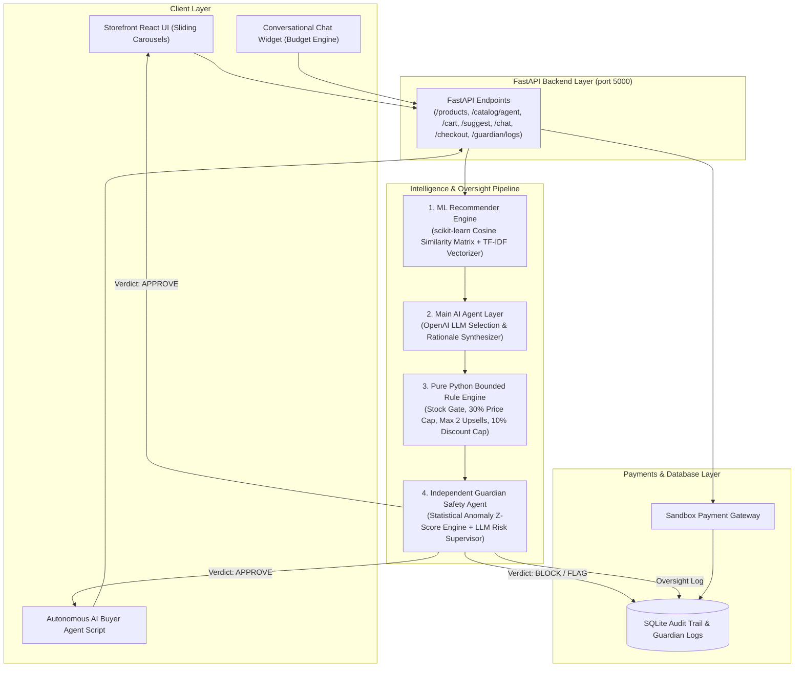

# SellSense 🧠
### Python ML & Agentic Commerce Platform with Guardian Safety Supervision

SellSense is an AI/ML-powered e-commerce platform built with **Python, FastAPI, scikit-learn, and SQLAlchemy**. SellSense combines **real machine learning (co-purchase cosine similarity + description TF-IDF embeddings)** with a **Python AI Agent**, a **Pure Python Bounded & Gated Rule Engine**, an **Independent Guardian Safety Agent**, an **Agent-Readable Catalog API**, **Autonomous AI Buyer Agent Simulation**, **Test Mode payments**, and **SQLAlchemy SQLite audit logging**.

---

## 📐 End-to-End Pipeline Architecture Diagram



### Pipeline Flow:
`Frontend/Chat/AI-Buyer → FastAPI → [ML Scoring → Main Agent → Rule Engine → Guardian Review] → Payment Gateway → SQLite logs`

---

## 🧠 ML Model Training, Scoring & Weight Persistence

SellSense utilizes a dual-signal hybrid machine learning model trained on realistic synthetic transaction histories.

### 1. Training Dataset Size
- **Catalog**: 30 products across 8 categories (*Audio, Accessories, Bags, Electronics, Wearables, Fitness, Home, Stationery*).
- **Transaction History**: 400 synthetic orders generated using realistic co-purchase pairs (e.g. laptop bags paired with wireless mice and power banks; workout mats paired with jump ropes).

### 2. Hybrid ML Scoring Method
$$ \text{HybridScore} = 0.6 \times \text{CoPurchaseSimilarity} + 0.4 \times \text{SemanticEmbeddingSimilarity} $$
- **Collaborative Signal**: `scikit-learn` Cosine Similarity computed on binary 400 Orders $\times$ 30 Products matrix.
- **Content Signal**: `TfidfVectorizer` NLP vector embeddings computed on product descriptions, categories, and tags.

### 3. Model Weight Persistence & Zero-Latency Serving
- Trained similarity matrices are serialized and saved to `backend/app/ml/model_weights.pkl`.
- On application startup, the FastAPI server checks for `model_weights.pkl` and loads pre-trained matrices into memory, eliminating retraining latency on inference calls.

---

## 🌟 Key Features & Core Components

1. **Conversational Budget Engine (`backend/app/agent/chat_agent.py`)**:
   - Structured numeric budget extraction supporting varied natural language queries (`"my budget is 500"`, `"budget 500"`, `"under 500"`, `"₹500"`, etc.).
   - **Hard Filter Enforcement**: `price <= budget` is applied directly to catalog queries so out-of-budget products are never passed to the LLM or suggested.
   - **Explicit Fallback**: If 0 items match the budget, explicitly notifies `"No products found under ₹{budget}. Here are the lowest-priced available options:"`.

2. **Synthetic Dataset Generator (`backend/app/db/seed.py`)**:
   - `pandas` + `numpy` generator building 30 catalog products and 400 synthetic co-purchase order histories saved to `synthetic_orders.csv`.

3. **ML Recommendation Engine (`backend/app/ml/recommender.py`)**:
   - Cosine similarity co-purchase matrix + TF-IDF description vector embeddings persisted as `.pkl`. Zero hardcoded category if/else heuristics.

4. **Independent Guardian Agent (`backend/app/guardian/guardian_agent.py`)**:
   - **Stage 1**: Calculates z-score statistical anomalies on discount percentages and cart price ratios.
   - **Stage 2**: Hard safety ceilings ($\le 15\%$ max discount, $\le 50\%$ cart price ratio).
   - **Stage 3**: LLM risk supervisor issuing `APPROVE`, `FLAG_FOR_REVIEW`, or `BLOCK` verdicts with written explanations.

5. **Agent-Readable Catalog API (`/catalog/agent` or `/api/catalog/agent`)**:
   - Structured JSON schema designed for autonomous AI buyer agents.

6. **Autonomous AI Buyer Simulation (`simulate_ai_buyer.py`)**:
   - Executable CLI script performing catalog discovery, LLM budget decision making, sandbox checkout, payment verification, and audit logging.

7. **Horizontal Sliding Carousels UI**:
   - Storefront category rows (Bags, Accessories, Audio, Electronics, etc.), checkout recommendation modal, and chat assistant results feature horizontal sliding carousels with smooth scrolling and hover animations.

---

## 🚀 Quick Start & Local Setup

### Prerequisites
- Python 3.10+
- Node.js 18+

### 1. Install Backend & Seed Database
```bash
pip install fastapi uvicorn sqlalchemy pandas numpy scikit-learn openai pytest
python backend/app/db/seed.py
```

### 2. Run Standalone Budget Unit Tests
```bash
python backend/tests/test_chat_budget.py
```

### 3. Start Servers
```bash
# Terminal 1: Backend Server (Port 5000)
python backend/run.py

# Terminal 2: Frontend Server (Port 5173)
cd frontend
npm run dev
```

### 4. Run Autonomous AI Buyer Simulation
```bash
python simulate_ai_buyer.py
```
