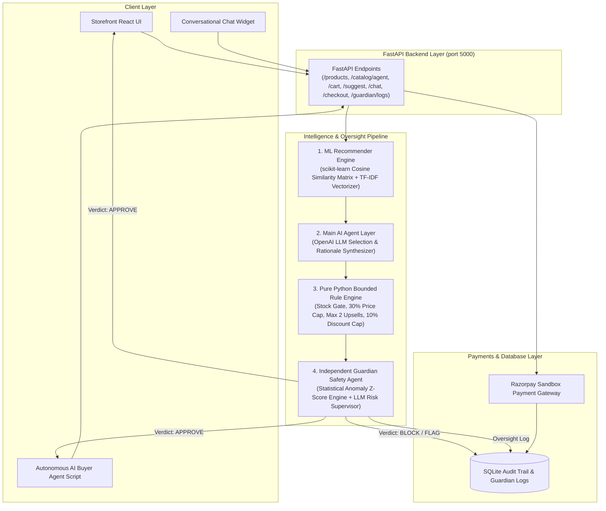

# NudgeAI 🧠
### Python ML & Agentic Commerce Platform with Guardian Safety Supervision
**Razorpay AI Buildathon Submission (Track: AI Growth & Agentic Commerce)**

NudgeAI is an AI/ML-powered e-commerce platform built with **Python, FastAPI, scikit-learn, and SQLAlchemy**. NudgeAI combines **real machine learning (co-purchase cosine similarity + description TF-IDF embeddings)** with a **Python AI Agent**, a **Pure Python Bounded & Gated Rule Engine**, an **Independent Guardian Safety Agent**, an **Agent-Readable Catalog API**, **Autonomous AI Buyer Agent Simulation**, **Razorpay Test Mode payments**, and **SQLAlchemy SQLite audit logging**.

---

## 📐 End-to-End Pipeline Architecture Diagram



### Pipeline Flow:
`Frontend/Chat/AI-Buyer → FastAPI → [ML Scoring → Main Agent → Rule Engine → Guardian Review] → Payment Gateway → SQLite logs`

---

## 🌟 Key Features & Core Components

1. **Synthetic Dataset Generator (`backend/app/db/seed.py`)**:
   - `pandas` + `numpy` generator building 10 catalog products and 120+ synthetic customer co-purchase order histories.
   - Exports order co-occurrence dataset as `synthetic_orders.csv` and populates SQLite database.

2. **ML Recommendation Engine (`backend/app/ml/recommender.py`)**:
   - **Co-Purchase Matrix**: Cosine similarity computed on binary transaction matrix.
   - **Semantic Embeddings**: `TfidfVectorizer` text similarity on product descriptions, categories, and tags.
   - **Hybrid Scoring**: $0.6 \times \text{CoPurchaseScore} + 0.4 \times \text{SemanticScore}$.

3. **Upsell/Cross-Sell Agent (`backend/app/agent/checkout_agent.py`)**:
   - Pipeline: ML candidates → LLM reasoning / Python agent rationale → Rule evaluation → Guardian safety review → Final personalized offers.

4. **Independent Guardian Agent (`backend/app/guardian/guardian_agent.py`)**:
   - **Stage 1 (Statistical Anomaly Check)**: Calculates z-scores on discount percentages, cart price ratios, and execution frequency against baselines.
   - **Stage 2 (Hard Safety Ceilings)**: Absolute discount cap $\le 15\%$, cart price ratio cap $\le 50\%$, and persona budget enforcement.
   - **Stage 3 (LLM Risk Supervisor)**: Evaluates intent and issues verdicts: `APPROVE`, `FLAG_FOR_REVIEW`, or `BLOCK` with written explanations.

5. **Conversational Checkout Agent (`backend/app/agent/chat_agent.py` & `/chat`)**:
   - Natural language intent parsing, budget extraction, catalog querying, and instant recommendations.

6. **Agent-Readable Catalog API (`/catalog/agent` or `/api/catalog/agent`)**:
   - Structured JSON schema designed specifically for external autonomous AI buyer agents.

7. **Autonomous AI Buyer Simulation (`simulate_ai_buyer.py`)**:
   - Standalone Python script executing an end-to-end agent-to-agent transaction: reads machine catalog, chooses item within persona budget, creates sandbox payment order, verifies payment, and logs audit trail.

8. **FastAPI Endpoints**:
   - `GET /products` & `GET /api/products` — Catalog listing
   - `GET /catalog/agent` & `GET /api/catalog/agent` — Machine-readable catalog for AI buyers
   - `POST /cart` & `POST /api/cart` — Cart validation & subtotal calculation
   - `POST /suggest` & `POST /api/suggest` — ML + Main Agent + Rule Engine + Guardian pipeline
   - `POST /chat` & `POST /api/chat` — Conversational checkout assistant
   - `POST /checkout` & `POST /api/payment/create-order` — Razorpay Sandbox order creation
   - `POST /payment/verify` & `POST /api/payment/verify` — HMAC signature verification & inventory deduction
   - `GET /guardian/logs` & `GET /api/guardian/logs` — Guardian oversight audit trail
   - `POST /guardian/simulate-misbehavior` — Trigger pitch demo rogue agent intervention
   - `GET /logs` & `GET /api/logs` — Complete SQLite audit trail & analytics

---

## 🚀 Quick Start & Local Setup

### 1. Install Dependencies
```bash
# Install Python backend requirements
pip install -r backend/requirements.txt

# Install React frontend requirements
npm install --prefix frontend
```

### 2. Start Servers
- **Terminal 1 (Python FastAPI Backend)**:
  ```bash
  python backend/run.py
  ```
  *(Server runs at `http://localhost:5000` — automatically seeds database and trains scikit-learn ML model)*

- **Terminal 2 (React Frontend)**:
  ```bash
  npm run dev --prefix frontend
  ```
  *(Vite Dev Server runs at `http://localhost:5173`)*

### 3. Run Autonomous AI Buyer Simulation (CLI Demo)
- **Terminal 3**:
  ```bash
  python simulate_ai_buyer.py
  ```

---

## 🛡️ Pitch Video Live Demo: Guardian Intervention

To demonstrate Guardian Agent catching and blocking rogue agent actions in real time:
1. Open `http://localhost:5173`.
2. Click **Guardian Safety** in the top navigation header.
3. Click **"Simulate Rogue 25% Discount"** or **"Simulate Budget Overspend"**.
4. Observe the **Guardian Agent** intercepting the rogue action live, issuing a `BLOCK` verdict, logging the statistical anomaly score, and displaying the plain-language safety explanation.

---

## 🏆 Submission Summary
- **Track**: AI Growth & Agentic Commerce
- **Key Innovation**: Dual-signal scikit-learn ML recommendation engine combined with an independent two-stage Guardian Safety Agent, pure Python safety gates, machine-readable agent catalog API, autonomous AI buyer simulation, Razorpay sandbox payment integration, and complete audit logging.
